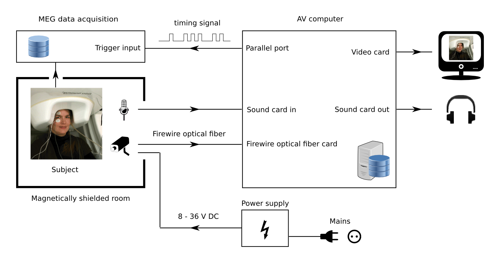

When it comes to building you video-recording hardware, you have a lot of different options. You can use different number of cameras, different camera and lens models, etc. To get you started, below is a fairly basic configuration that one can use as a starting point.  
Here's a schematic description of the setup:

The essential components are:  

1. **Video camera.** Stingray F-033 by Allied Vision Technologies (http://www.alliedvision.com) is a good choice. Note that when ordering the camera, you can specify a number of options. You need a camera with a GOF (Glass Optical Fiber) output. If you want to record in the darkness with the infrared (IR) light source, make sure that the camera comes without an IR cut filter.  
The camera is available in black-and-white and color versions. The video recording software supports both. The black-and-white version is somewhat more sensitive to infrared light, however, from my experience, the difference is insignificant in the video-MEG recordings.  

2. **Lens.** If you choose a Stingray F-033 camera, you will need a lens with a C-mount. The main parameter to consider when selecting a lens is a viewing angle. Which viewing angle is best for you depends on two things:
    - how far away from the participant you place the camera
    - how wide or narrow view of the participant and the surroundings you want to have  
Once you know the above two parameters, you can calculate the viewing angle you need (or, more exactly, the two viewing angles, since the angle is specified separately for the vertical and horizontal directions). The exact details of the calculation are left as an excercise for the reader.  
  After you decide which viewing angle you want, you select the lens accordingly. Note that the same lens will have different viewing angles for different sensor sizes (for Stingray F-033 the size is *Type 1/2*). Also, it may be a smart idea to buy a zoom lense that allows adjusting the viewing angle within a certain range.
  Additionally, if you want the IR capabilities, make sure that the lens is IR-corrected.  
 One possible choice for the lens is Ikegami TTV4012M-IR ([you can try to get more info from here](http://www.ikegami.de/ttv-lens-series/articles/ttv-lens-series.html)). It's a zoom lens, seems to have a reasonable range of viewing angles, and is IR-corrected.  

3. **Power supply for the camera.** You can get it from the camera manufacturer. Make sure that the cable is long enough for your setup.  

4. **Optical fiber.** for connecting the camera to the computer. You can get it from the camera manufacturer.  

5. **Mount adapter plate for the camera.** You probably want to mount the camera on a tripod or wall mount. Most of these use *1/4-20 UNC* thread nowadays. To mount the camera on one of these, you will need an adapter plate that can be ordered from the camera manufacturer.  

6. **Video recording computer.** The computer should have a 64-bit CPU (the so-called "amd64" architecture. Note that despite its' name it can be eiter AMD or Intel). Probably, any reasonably modern office PC will do. 4 GB of memory and 500 GB hard drive should be enough. Additionally:  
    - The computer should have a parallel port. As most modern computers don't have one, you probably need to use a separate parallel port card (typically, PCI-, or PCI-E-based).
    - The computer needs to have a GOF firewire port. You can get a GOF firewire card from Allied Vision Technologies (for example, model FWB1GLCPCIE1X10).
    - The computer should be equipped with a Linux-compatible soundcard. Most likely, that will be no problem.
    - All the hardware should work with Ubuntu Linux 16.04, amd64 version.  

7. **Parallel port cable.** You need a cable to connect the output of the computer's parallel port to the trigger input of your MEG machine. Probably the easiest way to get one is to solder it yourself.  

8. **Microphone.** The video recording computer will record the audio from the sound card's input. It's up to you to decide what to connect there, if anything. At our site, we use Sennheiser's MO 2000 optical microphone with custom-ordered 30-meter-long optical fiber, which seems to be no longer available from the manufacturer. You can try shopping for another optical microphone or use an electret microphone, which is much cheaper, but trickier to get into the shielded room.
